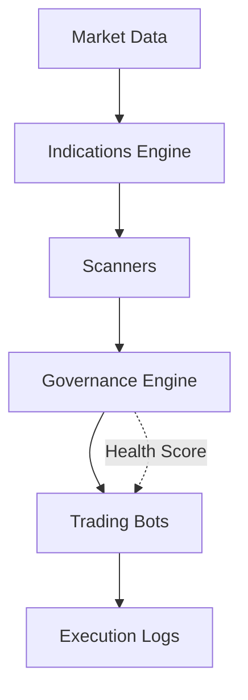

# Governed Trading System


**Institutional-grade algorithmic trading platform with multi-layer governance, real-time market scanners, and automated execution agents.**

---

## 🏛️ Project Overview

The **Governed Trading System** is a high-performance, semi-automated trading environment designed for institutional-level market simulation and paper trading. Built with a decoupled architecture (FastAPI + Next.js), it prioritizes safety through a proprietary **System Health Score** governance model.

### 🛡️ Core Governance
- **Hard Risk Limits**: Multi-layer constraints on drawdown, exposure, and position sizing.
- **Health-Based Execution**: Automated pause/resume of bots based on trailing performance metrics.
- **Circuit Breakers**: Correlation-based halts during systemic market volatility.

### 🔍 Market Intelligence
- **Scanners**: 5 core engines (Trend Alignment, Volatility Compression, Volume Profile, etc.).
- **Signal Logic**: AI-enhanced signal detection with real-time confidence scores.
- **Execution**: Modular bot system implementing institutional strategies (VWAP Reversion, Momentum Scalping).

---

## 🏗️ Technical Architecture



- **Backend**: Python 3.10+, FastAPI, SQLAlchemy, yfinance.
- **Frontend**: Next.js 14, React 18, Tailwind CSS, Shadcn UI, Sonner.
- **Database**: SQLite (Production-ready simulation state).

---

## 🚀 Quick Start

### 1. Backend Setup
```bash
cd backend
python -m venv venv
source venv/bin/activate
pip install -r requirements.txt
python main.py
```

### 2. Frontend Setup
```bash
npm install
npm run dev
```

---

## 📚 Documentation Suite

Explore our professional documentation hosted on GitHub Pages:

- 📖 **[Documentation Hub](https://opendev-labs.github.io/governed-trading-system/)**
- ⚙️ **[Technical Architecture](https://opendev-labs.github.io/governed-trading-system/technical.html)**
- 🔒 **[Governance & Risk](https://opendev-labs.github.io/governed-trading-system/governance.html)**
- 📊 **[Trading Strategies](https://opendev-labs.github.io/governed-trading-system/strategies.html)**
- ✅ **[Compliance Audit](https://opendev-labs.github.io/governed-trading-system/verification.html)**

---

## 🏆 Final Verification

The system has been rigorously tested against Lakhan Bhai's Institutional Requirements.

**Status: 100% COMPLIANT**  
**Verdict: PASSED WITH DISTINCTION**

---

© 2026 Governed Trading System. Licensed under MIT.